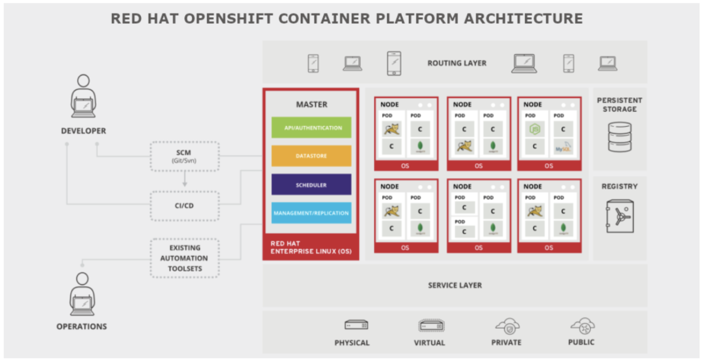

# OpenShift Container Platform overview

                                                               

**Openshift Container Platform(OCP)** is RedHat Platform as a service (PaaS) offering that to customers as a full stack platform for creating/maintaining multi tenets application ( micro-services).

* Red Hat OpenShift is a Platform as a service(Paas) based on Kubernetes. 

## What is Kubernetes ? 
* The name Kubernetes originates from Greek, meaning helmsman or pilot. Google open-sourced the Kubernetes project in 2014. Kubernetes combines over 15 years of Google's experience running production workloads at scale with best-of-breed ideas and practices from the community.

* Kubernetes is an open source container orchestration engine for automating deployment, scaling, and management of containerized applications.

# OpenShift Architecture

# **Key architectural components of OpenShift 4.x & kubernetes**

### 1. OpenShift 4.X Build ?
*  OpenShift 4.X Build on Red Hat CoreOS for masters and Red Hat Enterprise Linux for other nodes. 
*  Red Hat CoreOS provides "Immutability", allows to modify only a few system settings, and make it much easier to manage upgrades & patches and This immutability allows OpenShift do better state management and perform updates based on the latest configurations.

### 2. Components ?
Similar concepts of open source kubernetes - Control Plane Components and few of other special components are offered by OpenShift, such as **Route/Router,Registry,Operators,Machine Management( Machine, MachineSets , MachineAutoScaler and ClusterAutoScalier) and Projects(namespaces)**

**1.** **Kube-apiserver**: The API server is a component of kubernetes contol plane that exposes the kubernetes API.The API server is the front end for the Kubernetes control plane.

**2.** **etcd** : Consistent and highly-available key value store used as kubernetes backing store for all cluster data.

**3.** **kube-scheduler** : Control plane component that watches for newly created Pods with no assigned node, and selects a node for them to run on.

**4.** **kube-controller-manager** : Control Plane component that runs controller processes.
 
**5.** **Node Components** 

**5.1.** **kubelet** : 
* An agent that runs on each node in the cluster. It makes sure that containers are running in a Pod.
* The kubelet takes a set of PodSpecs that are provided through various mechanisms and ensures that the containers described in those PodSpecs are running and healthy. The kubelet doesn't manage containers which were not created by Kubernetes.

**5.2** **kube-proxy** :
* kube-proxy maintains network rules on nodes. These network rules allow network communication to your Pods from network sessions inside or outside of your cluster.
* kube-proxy uses the operating system packet filtering layer if there is one and it's available. Otherwise, kube-proxy forwards the traffic itself.
 

**6.** **Routes/Routers** : 
* OpenShift Container platform router as the ingress point for external traffic destined for services in the OpenShift Container Platform.
* An OpenShift route is a way to expose a service by giving it an externally-reachable hostname like www.example.com.
* OpenShift uses HAProxy load balancer as a default router

***Kubernetes Vs OpenShift***

      
| kubernetes | OpenShift |
| --- | --- |
| Ingress resource (rules) | Route (rules) |
| [Ingress Controller](https://kubernetes.io/docs/concepts/services-networking/ingress-controllers/) ( Nginx / HAProxy container) | Router (HAProxy container)|

**7.** **Project** :
* In OpenShift, A project allows a community of users to organize and manage their content in isolation from other communities.
* The projects are controlled by access controlled and restricted t provide resources on individual projects.
* In Kubernetes, The primary grouping concept is called `namespace`, Namespaces are also a way to divide cluster resources as isolated between multiple uses.  

**8.** **Registry** :
* OpenShift Container Platform can build container images from your source code, deploy them, and manage their lifecycle. To enable this, OpenShift Container Platform provides an internal, integrated container image registry that can be deployed in your OpenShift Container Platform environment to locally manage images.

**9.** **Operators:** :
* The operators is on of the important component, Which allows to extend the OpenShift cluster and customize the resources controllers & build a more manageable system. 
* The operators that governs the custom resource definition (CRD) deployment, creation, registory, monitoring of the CRDs and also upgrades to the cluster.

**10.** **Machine Management** :
* Machine Management is one of the most important ecosystem of resources & operators in Openshift 4.X (4.7). These resources and operators provide a comprehensive set of APIs for all node host provisioning & works with the Cluster API for providing the elasticity & autoscaling.

* Machine: Machine is the fundamental unit that represents the k8 node, which abstracts the cloud platform “specific” implementations. The machine “providerSpec” describes the actual compute node, that gets realized. MachineConfig defines the machine configuration.

* MachineSets: Like how replicaSets manage the replicas, and ensure and maintain the “Desired state”, MachineSet ensure the desired state of a number of machine (nodes) that are running.

* MachineAutoScaler: MachineAutoScaler works with MachineSets to manage the load and automatically scale the cluster. The minimum and maximum number of machines are set in MachineSet, and MachineAutoScaler manages scalability

* ClusterAutoScaler: This ClusterAutoScaler manages the cluster wise scaling policy based on various cluster-wide parameters such as cores, memory, GPU, etc.